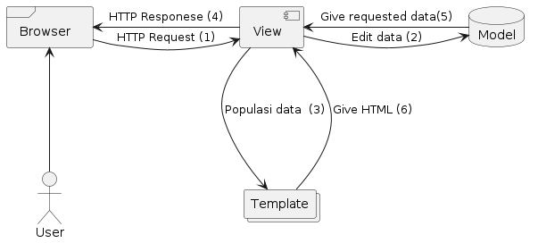

# E-Jersey
---
 
Nama    : Muhammad Naufal Ramadhan  
NPM     : 2306241700  
Kelas   : D  
 

---
#### 1. Jelaskan bagaimana cara kamu mengimplementasikan checklist di atas secara step-by-step (bukan hanya sekadar mengikuti tutorial).
  * Saya mengimplementasi checklist di atas dengan mengikuti tutorial dan juga menyesuaikan dengan konteks produk saya. Jika ada beberapa hal yang perlu dilakukan tetapi belum ada di tutorial, saya menggali lebih dalam di Google, seperti _pass_ paramater pada view.
 

#### 2. Buatlah bagan yang berisi request client ke web aplikasi berbasis Django beserta responnya dan jelaskan pada bagan tersebut kaitan antara urls.py, views.py, models.py, dan berkas html. 
 

  
   
  
  1. Pertama, User akan melakukan HTTP request yang kemudian akan di handle oleh View. Untuk menentukan apa yang direquest dan apa yang akan di respon balik, akan ditentukan di dalam urls.py. Berdasarkan pattern url yang direquest, akan menentukan function View apa yang akan dijalankan didalam Views.py.
  2. View me-request data yang diperlukan untuk ditampilkan kepada user, data-data yang diperlukan sudah tercantum didalam function view yang dijalankan, dan akan _Get_ data field yang tersedia didalam models.py.
  3. View akan me-request HTML apa yang dipopulasikan dengan data pada Template, untuk menentukan berkas HTML yang mana akan di-request sudah ditentukan di dalam function View. Lalu setelah dapat berkas HTML yang di-request kemudian akan direspon balik ke User dengan HTML yang sudah dipopulasikan dengan data dalam bentuk HTTP.
 

#### 3. Jelaskan fungsi git dalam pengembangan perangkat lunak!
  *  Git mempunyai beberapa peran penting dalam pengembangan perangkat lunak, diantaranya :
     
      1. Version Control
          * Dengan git, semisal kita melakukan pengembangan aplikasi berkala, dengan adanya git yang berperan sebagai version control, kita dapat melihat dan membandingkan perubahan apa saja dibandingkan versi aplikasi yang sebelumnya. Selain itu, jika aplikasi kita terdapat bug atau error semacamnya dan tidak bisa di-fix, kita dapat me-_rollback_ aplikasi kita pada versi sebelumnya.
      2. Platform Kolaborasi
          * Dengan git memungkinkan untuk beberapa developer untuk berkolaborasi untuk mengembangkan sebuah aplikasi. Git me-support _branching_ dan _merging_, sehingga memungkinkan untuk beberapa developer untuk mengerjakan fitur aplikasi masing-masing pada _branch_ yang sudah ditentukan, dan jika sudah selesai dapat di _merge_ ke dalam branch utama.
      3. Backup
          * Dengan menggunakan git, automatis kita me-_upload_ code kita ke-_cloud_, dengan server git yang sudah terdistribusi di berbagai belahan dunia. Sehingga jika kita kehilangan komputer fisik kita, kode kita masih tersimpan di server git.
 

#### 4. Menurut Anda, dari semua framework yang ada, mengapa framework Django dijadikan permulaan pembelajaran pengembangan perangkat lunak?
  * Menurut saya, Django sendiri memiliki konsep yang jelas dengan model MVT itu sendiri. Selain itu, bahasa utama yang digunakan juga python, bahasa yang menurut saya lebih _straight-forward_ dan tidak menggunakan begitu banyak simbol-simbol dibandingkan dengan bahasa lain. Ditambah dengan banyaknya dokumentasi yang tersedia, komunitas yang luas, dan sudah banyak _built-in-feature_ yang tersedia.
 

#### 5. Mengapa model pada Django disebut sebagai ORM?
  * ORM itu sendiri memiliki arti Object-Related-Mapping, atau sebuah teknik untuk me-_convert_ sebuah object menjadi object pada sistem lain. dan Models pada django dapat disebut sebagai ORM, karena django memiliki peran sebagai _interface_ diantara Object pada Python dengan table pada sql. Pada Django, kita tidak perlu ber-urusan dengan sql, kita bisa langsung add, update, delete database langsung dengan python.
