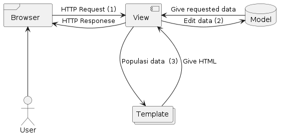
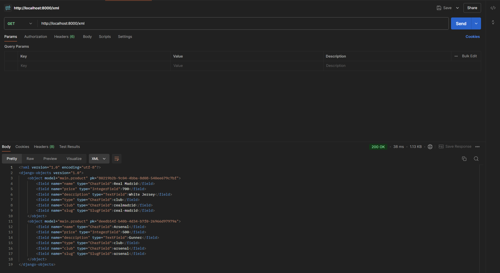
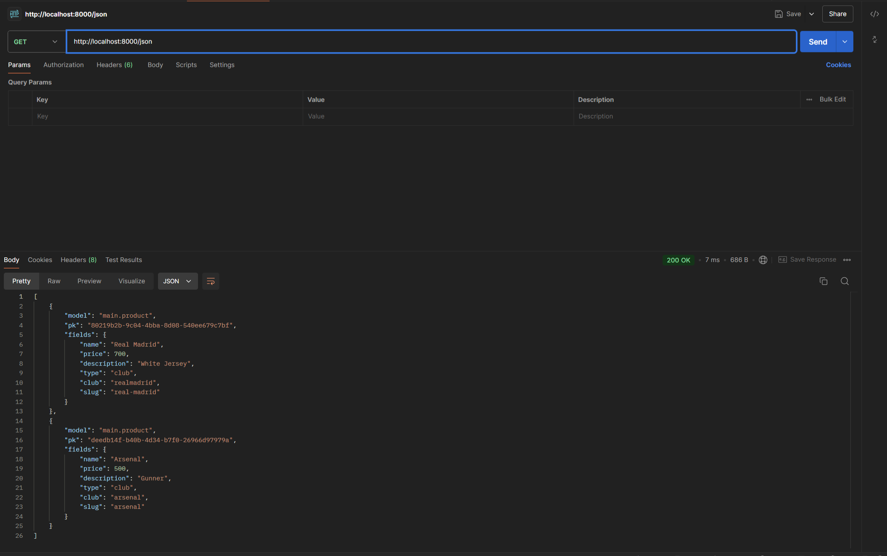
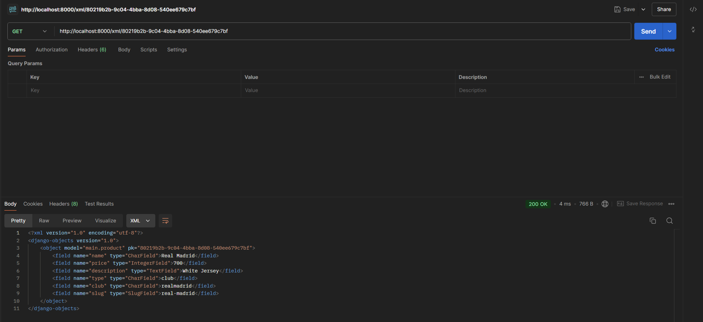
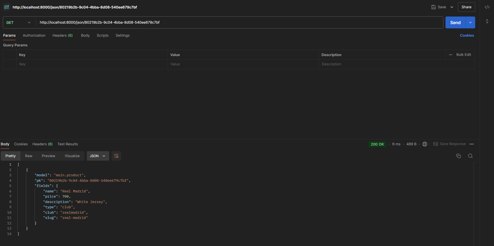

# E-Jersey
---
<br>
Nama    : Muhammad Naufal Ramadhan <br>
NPM     : 2306241700 <br>
Kelas   : D <br>

Link Web : http://muhammad-naufal324-ejersey.pbp.cs.ui.ac.id/
<br>

---
<details>
<summary>
Tugas 2
</summary>
 
#### 1. Jelaskan bagaimana cara kamu mengimplementasikan checklist di atas secara step-by-step (bukan hanya sekadar mengikuti tutorial).
 1) Langkah Pertama yaitu me-setup. Pertama, membuat repository baru di Github, kemudian Clone ke Local. Setelah inisialisasi github selesai, tambahkan gitignore dan lain-lain, di dalam dir git, saya inisiasi virtual environment untuk project tersebut, kemudian saya menginstall semua dependency yang diperlukan pada virtual environment nya, seperti django.
 2) Pada tahap ini, saya membuat project E-jersey saya dan membuat app dalam project tersebut bernama main, dengan menjalankan `django-admin startproject e_jersey .` untuk membuat project, dan `python manage.py startapp main` untuk membuat aplikasi bernama main.
 3) Setelah ini selesai, saya me_include_ aplikasi dan url main saya pada settings.py dan urls.py di dir project, setelah itu juga menambahkan url pada url di level aplikasi main, sehingga django bisa mehandle pola url yang akan diberikan.
 4) Selanjutnya membuat model dengan bernama Product, inisialisasi dilakukan pada models.py, field yang saya berikan pada Product saya meliputi, nama, harga, description, club, type, dan slug.
 5) Lalu, saya membuat beberapa template HTML yang akan saya tampilkan pada user, template-template saya simpan di directory template didalam directory main.
 6) Selanjutnya saya membuat beberapa fungsi pada views, untuk menghandle beberapa pola url yang diterima, sehingga views dapat menentukan template apa yang akan dipakai dan data apa saja yang perlu difetch agar bisa sampai pada user dalam bentuk yang komplet.
 7) Setelah semua selesai, saya membuat project baru pada website pws. Sehingga git saya memiliki dua remote, yaitu remote origin dan remote pws. Selanjutnya saya push ke dua remote tersebut, sehingga pws dapat me_build_ project saya dan dideploy, sehingga teman-teman saya dapat melihat web saya dari komputernya masing-masing.
 8) Selanjutnya saya membuat README.md pada github saya untuk menjawab beberapa pertanyaan seperti yang saya lakukan pada saat saya mengetik sekarang. 
<br>

#### 2. Buatlah bagan yang berisi request client ke web aplikasi berbasis Django beserta responnya dan jelaskan pada bagan tersebut kaitan antara urls.py, views.py, models.py, dan berkas html. 
<br>

  
  <br>
  
  1. Pertama, User akan melakukan HTTP request yang kemudian akan di handle oleh View. Untuk menentukan apa yang direquest dan apa yang akan di respon balik, akan ditentukan di dalam urls.py. Berdasarkan pattern url yang direquest, akan menentukan function View apa yang akan dijalankan didalam Views.py.
  2. View me-request data yang diperlukan untuk ditampilkan kepada user, data-data yang diperlukan sudah tercantum didalam function view yang dijalankan, dan akan _Get_ data field yang tersedia didalam models.py.
  3. View akan me-request HTML apa yang dipopulasikan dengan data pada Template, untuk menentukan berkas HTML yang mana akan di-request sudah ditentukan di dalam function View. Lalu setelah dapat berkas HTML yang di-request kemudian akan direspon balik ke User dengan HTML yang sudah dipopulasikan dengan data dalam bentuk HTTP.
<br>

#### 3. Jelaskan fungsi git dalam pengembangan perangkat lunak!
  *  Git mempunyai beberapa peran penting dalam pengembangan perangkat lunak, diantaranya :
    <br>
      1. Version Control
          * Dengan git, semisal kita melakukan pengembangan aplikasi berkala, dengan adanya git yang berperan sebagai version control, kita dapat melihat dan membandingkan perubahan apa saja dibandingkan versi aplikasi yang sebelumnya. Selain itu, jika aplikasi kita terdapat bug atau error semacamnya dan tidak bisa di-fix, kita dapat me-_rollback_ aplikasi kita pada versi sebelumnya.
      2. Platform Kolaborasi
          * Dengan git memungkinkan untuk beberapa developer untuk berkolaborasi untuk mengembangkan sebuah aplikasi. Git me-support _branching_ dan _merging_, sehingga memungkinkan untuk beberapa developer untuk mengerjakan fitur aplikasi masing-masing pada _branch_ yang sudah ditentukan, dan jika sudah selesai dapat di _merge_ ke dalam branch utama.
      3. Backup
          * Dengan menggunakan git, automatis kita me-_upload_ code kita ke-_cloud_, dengan server git yang sudah terdistribusi di berbagai belahan dunia. Sehingga jika kita kehilangan komputer fisik kita, kode kita masih tersimpan di server git.
<br>

#### 4. Menurut Anda, dari semua framework yang ada, mengapa framework Django dijadikan permulaan pembelajaran pengembangan perangkat lunak?
  * Menurut saya, Django sendiri memiliki konsep yang jelas dengan model MVT itu sendiri. Selain itu, bahasa utama yang digunakan juga python, bahasa yang menurut saya lebih _straight-forward_ dan tidak menggunakan begitu banyak simbol-simbol dibandingkan dengan bahasa lain. Ditambah dengan banyaknya dokumentasi yang tersedia, komunitas yang luas, dan sudah banyak _built-in-feature_ yang tersedia.
<br>

#### 5. Mengapa model pada Django disebut sebagai ORM?
  * ORM itu sendiri memiliki arti Object-Related-Mapping, atau sebuah teknik untuk me-_convert_ sebuah object menjadi object pada sistem lain. dan Models pada django dapat disebut sebagai ORM, karena django memiliki peran sebagai _interface_ diantara Object pada Python dengan table pada sql. Pada Django, kita tidak perlu ber-urusan dengan sql, kita bisa langsung add, update, delete database langsung dengan python.

</details>

<details>
<summary>
Tugas 3
</summary>

 #### 1. Jelaskan mengapa kita memerlukan data delivery dalam pengimplementasian sebuah platform?
  * Karena pada platform, sekarang diperlukan sinkronisasi data secara _real-time_, selain itu biasanya pada sebuah platform semuanya terbagi-bagi dalam beberapa komponen. Contohnya ada _client-side_ dan _server-side_, semisal terdapat dua user yang sedang menggunakan platformnya, dan user pertama melakukan POST request dan kemudian user selanjutnya melakukan GET request, disini diperlukan _data delivery_ sehingga user kedua mendapatkan informasi yang terbaru. Data delivery memungkinkan komponen-komponen seperti _client-side_ dan _server-side_ untuk berkomunikasi sehingga data pada keduanya dapat sinkron secara _real-time_.
<br>

 #### 2. Menurutmu, mana yang lebih baik antara XML dan JSON? Mengapa JSON lebih populer dibandingkan XML?
  * Menurut saya sendiri, saya lebih memilih JSON. Untuk alasan mengapa JSON lebih populer dibandingkan XML karena dari sintaksnya sendiri JSON lebih mudah dan tidak se-verbose XML, lalu JSON juga merupakan native JavaScript dan JavaScript sendiri sekarang sedang sangat populer dengan framework-frameworknya, ditambah juga dengan kemudahan proses _parsing_ dari JSON itu sendiri dibandingkan dengan XML.
<br>

 #### 3. Jelaskan fungsi dari method is_valid() pada form Django dan mengapa kita membutuhkan method tersebut?
 * Fungsi dari `is_valid()` adalah untuk me-validasi data-data pada form yang akan di proses, semisal tiap fields pada form tidak boleh blank, maka `is_valid()` akan cek tiap field apakah tidak blank, jika blank maka akan return false, dan dapat dihandle lebih lanjut.
<br>

 #### 4. Mengapa kita membutuhkan csrf_token saat membuat form di Django? Apa yang dapat terjadi jika kita tidak menambahkan csrf_token pada form Django? Bagaimana hal tersebut dapat dimanfaatkan oleh penyerang?
 * csrf_token digunakan untuk mengecek bahwa request yang datang benar dari user yang sebenarnya dan tidak di-_intercept_ atau di-_impersonate_ oleh _unauthorized user_. Jika kita tidak mengeimplementasikan csrf_token bisa saja penyerang mengirim request yang dapat mengancam data-data vital, seperti menghapus data vital atau meminta data-data _confidential_.
<br>

 #### 5. Jelaskan bagaimana cara kamu mengimplementasikan checklist di atas secara step-by-step (bukan hanya sekadar mengikuti tutorial).
  1) Membuat input form dengan membuat `forms.py` pada project main. dan membuat class sendiri untuk produk yang mengimplementasikan dari class bernama `ModelForm`. Kemudian untuk menerima input dari user dan menambahkan objek dari model, saya membuat template lain hanya untuk menerima input dalam bentuk table, kemudian jika user me-request POST, maka data yang di-input akan divalidasi dan akan di-simpan ke dalam database menggunakan `form.save()`.
  2) Untuk membuat 4 fungsi views untuk melihat object-object dalam bentuk XML dan JSON, perlu membuat views function nya itu sendiri, saya sendiri memberi namanya `show_xml`, `show_json`, `show_xml_by_id`, dan `show_json_by_id`. Yang akan mereturn object dari database ke dalam bentuk XML atau JSON menggunakan `serializers` dan direspon balik ke user dalam bentuk HTTP menggunakan `HttpResponse`. Untuk kasus view function untuk melihat product berdasarkan id, terdapat parameter tambahan yaitu `id`. Contoh :<br>
  
     ```
     HttpResponse(serializers.serialize("xml", data), content_type="application/xml")
     ```
  3) Setelah itu, saya juga harus membuat url nya masing-masing view function pada `urls.py`, agar dapat di-request oleh user. Untuk kasus pada urls yang dinamis, seperti ketika me-request url dengan id product, diimplementasikan dengan cara menggunakan `<str:id>` pada pola url, disini menyatakan bahwa akan ada terdapat parameter tambahan yang berupa string bernama id yang kemudian akan di proses pada views function. Contoh :<br>

     ```
        path('xml/<str:id>', views.show_xml_by_id, name='show_xml_by_id_url'),
     ```

### Screenshot pada Postman
# XML
 
 # JSON
 
 # XML_ID
 
 # JSON_ID
 

 </details>

 <details>
 <summary>
  Tugas 4
 </summary>
  
 #### 1. Apa perbedaan antara HttpResponseRedirect() dan redirect()
  * `HttpResponseRedirect()` berfungsi untuk me-redireksi browser ke URL lain, sama dengan `redirect()`, perbedaanya terletak pada parameter URL yang di-pass, untuk `HttpResponseRedirect()` URL yang di-pass harus dalam bentuk tradisional URL sedangkan pada `redirect()` kita dapat pass nama URL nya saja yang telah didefinisikan pada `urls.py`. Sebagai contoh :
  ```
  return HttpResponseRedirect('/main/home/')
  ```
  ```
  return redirect('main:home')
  ```
 * Sebagai tambahan, `redirect()` adalah shortcut yang disediakan oleh django yang terdiri dari `HttpResponseRedirect()` + `reverse()`. Sehingga lebih singkat dan mudah untuk di baca.
   <br>
   
 #### 2. Jelaskan cara kerja penghubungan model Product dengan User!
  * Pada kasus yang telah saya buat, saya menghubungkan Product dengan User pada models.py untuk model produk saya, dengan relasi `ForeignKey`, atay relasi _many to one_. dengan syntax sebagai berikut.
    ```
    user = models.ForeignKey(User, on_delete=models.CASCADE)
    ```
  * Dengan penggunaan `ForeignKey` disini, kita bilang bahwa Produk hanya bisa dimiliki oleh satu User saja, tetapi User dapat memiliki banyak Produk. Parameter `on_delete=models.CASCADE` disini berfungsi untuk mengonfigurasi tindakan jika User dihapus, maka semua produk yang di-map ke user tersebut akan ikut terhapus juga.
    <br>
    
 #### 3. Apa perbedaan antara authentication dan authorization, apakah yang dilakukan saat pengguna login? Jelaskan bagaimana Django mengimplementasikan kedua konsep tersebut.
 * Authentication adalah proses untuk otentikasi User, atau untuk verifikasi apakah user yang login memang benar adalah dia, kita dapat Authenticate user dengan cek ID dan Password yang diberikan match dengan yang ada di database.
 * Authorization adalah proses untuk menentukan akses level dari user tersebut, dengan contoh apakah user yang login memiliki akses izin untuk mengakses sebuah resource tertentu.
 * terdapat implementasi kedua konsep tersebut dalam django. Untuk Authentication digunakan ketika terdapat user yang ingin login ke dalam suatu website, yaitu pada form `AuthenticationForm` fungsi `login()`, `AuthenticationForm` adalah form bawaan django yang dibuat untuk memudahkan proses login pada projek django. dengan contoh:
   ```
   form = AuthenticationForm(data=request.POST) # Inisiasi form untuk login
        if form.is_valid(): # Cek apakah form yang disubmit valid (apakah user berhasil ter-otentikasi)
            user = form.get_user() # Fetch user pada form yang disubmit
            login(request, user) # Log user pada website dengan memberi session.
   ```
* untuk implementasi Authorization pada django, terdapat decorator `@permission_required` atau attribute `has_perm()`. Contoh:
     ```
     @permission_required("foo.add_choice")
     add: user.has_perm('foo.add_bar')
     change: user.has_perm('foo.change_bar')
     delete: user.has_perm('foo.delete_bar')
     view: user.has_perm('foo.view_bar')
     ```
     <br>
     
 #### 4. Bagaimana Django mengingat pengguna yang telah login? Jelaskan kegunaan lain dari cookies dan apakah semua cookies aman digunakan?
 * Django mengingat pengguna yang telah login menggunakan session. Saat pengguna login berhasil:
    * Django membuat session ID yang unik untuk pengguna tersebut.
    * Session ID ini disimpan di cookies pada browser pengguna.
    * Setiap kali pengguna mengunjungi halaman baru, Django memeriksa session ID yang tersimpan di cookies dan mencocokkannya dengan session di server.
    * Jika session ID valid, Django menganggap pengguna masih dalam status login.

 * Fungsi lain dari Cookies bisa digunakan untuk menyimpan preferensi tertentu pada website, atau contoh langsungnya ketika kita menyimpan keranjang pada e-commerce tanpa perlu login, walaupun kita pindah laman, browser tetap tahu keranjang yang kita simpan. dengan menggunakan session id yang tersimpan pada cookies di browser.
 * Tidak semua cookies aman digunakan, semisal kita menggunakan protokol HTTP dari pada HTTPS. Sehingga cookie yang tersimpan tidak ter-enkripsi, yang memungkinkan seseorang untuk melihat data-data yang tersimpan pada cookie tersebut.
 
 #### 5. Jelaskan bagaimana cara kamu mengimplementasikan checklist di atas secara step-by-step (bukan hanya sekadar mengikuti tutorial).
 ##### 1. Mengimplementasikan fungsi registrasi, login, dan logout untuk memungkinkan pengguna untuk mengakses aplikasi sebelumnya dengan lancar.
   Membuat view function untuk registrasi, login, dan logout pada views.py
   * Register <br>
   Pada `views.py`
     ```
     def register(request):
       form = UserCreationForm() # Inisiasi Form registrasi

       if request.method == "POST": # Jika user memberikan post request, atau saat menekan tombol submit
         form = UserCreationForm(request.POST)
         if form.is_valid(): # Cek apakah form yang disubmit valid
             form.save() # Jika valid, user akan disimpan pada database.
             messages.success(request, 'Your account has been successfully created!')
             return redirect('main:login') # Di redireksi pada laman login
       context = {'form':form} # Jika berupa get request, maka akan diberikan form registrasi kosong
       return render(request, 'register.html', context) # Return html yang sudah jadi
     ```
      Menambahkan url untuk registrasi Pada `urls.py`
    
     ```
      path('register/', views.register, name='register'),
     ```
      Menambahkan `register.html` untuk registrasi Pada folder template
    
   * Login <br>
   Pada `views.py`
     ```
     def login_user(request):
       if request.method == 'POST': # Jika request yang diberikan ke server adalah post (ketika menekan tombol login)
         form = AuthenticationForm(data=request.POST) # akan dibuatkan form untuk otentikasi user
         if form.is_valid(): # Jika otentikasi berhasil
             user = form.get_user() # Fetch user dari form
             login(request, user) # me log user dan di set telah ter logged in
             response = HttpResponseRedirect(reverse("main:main_view_url")) # memberikan reponse yang akan redireksi user ke laman utama
             response.set_cookie('last_login', str(datetime.datetime.now())) # set last_login cookie
             return response
       else: # Jika get request
         form = AuthenticationForm(request) # Akan memberikan form kosong
     context = {'form': form}
     return render(request, 'login.html', context)
     ```
      Menambahkan url untuk registrasi Pada `urls.py`
    
     ```
      path('login/', views.login_user, name='login'),
     ```
     Menambahkan `login.html` untuk registrasi Pada folder template

   * Logout <br>
   Pada `views.py`
     ```
     def logout_user(request):
       logout(request) # Akan log out user yang terdapat pada request
       response = HttpResponseRedirect(reverse('main:login')) # akan di redirect ke laman login
       response.delete_cookie('last_login') # menghapus last login cookie
       return response
     ```
      Menambahkan url untuk registrasi Pada `urls.py`
    
     ```
      path('logout/', views.logout_user, name='logout'),
     ```
     
  ##### 2. Menghubungkan model Product dengan User.
   * Pada `models.py` ditambahkan field baru untuk user. Seperti berikut.
     ```
     user = models.ForeignKey(User, on_delete=models.CASCADE)
     ```
   * Kemudian jalakankan
     ```
     python manage.py makemigrations 
     ```
   * Akan diberikan warning untuk set field kosong pada produk yang telah dibuat sebelumnya, kita dapat set default pada models nya lansung dengan contoh menjadi nullable, tetapi karena pada tahap ini sudah terdapat user yang terdaftar pada database dengan userid=1, maka saya akan set produk yang telah terdaftar sebelumnya ke user dengan id = 1.
   * Kemudian jalakan
     ```
     python manage.py migrate
     ```
     Maka Produk pada database telah memiliki field User.
  
  ##### 3. Membuat dua akun pengguna dengan masing-masing tiga dummy data menggunakan model yang telah dibuat pada aplikasi sebelumnya untuk setiap akun di lokal.
  * Karena sudah tidak ada masalah pada database, saya menambahkan user dengan fungsi registrasi yang telah dibuat sebelumnya, dan menambahkan produk nya juga menggunakan fungsi yang telah dibuat sebelumnya pada tugas 2.

  #### 4. Menampilkan detail informasi pengguna yang sedang logged in seperti username dan menerapkan cookies seperti last login pada halaman utama aplikasi.
   * Untuk set cookie ketika login, saya menambahkan ini pada fungsi `login_user()` di `views.py`.
     ```
     response.set_cookie('last_login', str(datetime.datetime.now()))
     ```
   * kemudian pada fungsi `main_view` pada `views.py`, saya menambahkan decorator `@login_required` yang mewajibkan user untuk ter-logged in sebelum bisa akses ke laman utama. Dan mengubah key `name` dan menambahkan key `last_login` pada context, seperti berikut.
     ```
     "nama" : request.user.username
     "last_login": request.user.last_login,
     ```
   * Sehingga nama yang akan disisipkan pada html adalah nama yang user yang terlogged, dan mengambil last_login pada user yang terlogged in, saya menghindari mengambil dari COOKIES karena terdapat kejadian dimana cookies last_login telah terhapus tetapi user nya tidak ter-logged out. Karena User tidak ter-logged out maka user dapat memasuki laman main, karena pada context pada view main perlu cookies last_login dan cookies yang dibicarakan disini sudah terhapus, maka membuat key error pada laman tersebut, dan untuk logout usernya dan login ulang untuk set cookies nya lagi.  
   * Dan yang terakhir menambahkan kode berikut pada `main.html`. Untuk menampilkan terakhir kali login.
     ```
     Sesi terakhir login: {{ last_login }}
     ```
 </details>
